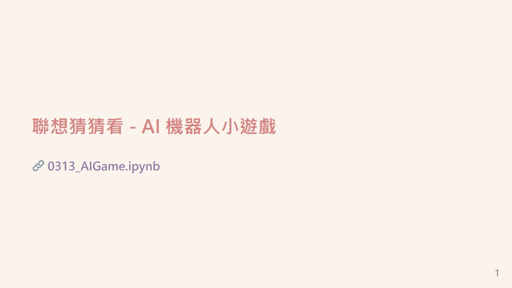

# Programming Language
1132 程式語言

授課教師：蔡芸琤老師

 

- [Programming Language](#programming-language)
  - [作業一](#作業一)
  - [作業二](#作業二)
  - [作業三](#作業三)
  - [作業四](#作業四)

## 作業一
[程式碼](./0313_AIGame.ipynb) | [Colab](https://colab.research.google.com/github/samko5sam/programming-language-class/blob/main/0313_AIGame.ipynb)

小遊戲：讓兩個AI進行猜字詞的遊戲，看看誰答對的比較多

_🔽 簡介簡報_

## 作業二

[程式碼](./0320_DataVisualization.ipynb) | [Colab](https://colab.research.google.com/github/samko5sam/programming-language-class/blob/main/0320_DataVisualization.ipynb)

繪製圖表看EFT VOO的表現

## 作業三

[程式碼](./0327_Visualization.ipynb) | [Colab](https://colab.research.google.com/github/samko5sam/programming-language-class/blob/main/0327_Visualization.ipynb)

PCA 主要分析步驟：

1. **選擇特徵**：選擇用於 PCA 與 K-Means 聚類分析的數值型特徵，如 `AGE`、`HEIGHT`、`WEIGHT`等等。

2. **資料預處理（標準化）**：使用 `StandardScaler` 對選擇的數據進行標準化處理，以便確保每個特徵在同等尺度下進行分析。

3. **執行 PCA 降維**：
   - 利用 scikit-learn 的 `PCA` 來計算數據集的主成分。
   - 調用 `fit_transform` 方法計算主成分，並獲取特徵空間中的數據表示。
   - 獲取解釋變異比例，這能幫助判斷選取多少主成分是合適的。

6. **Kmeans 分群**：
   - 確定主成分數量後，得到降維後的新數據表示。
   - 使用 Kmeans 進行分群。

*Chicago sex offenders*

K-means 分群的結果：

1.  **分群基礎**：第一張圖顯示了使用 K-means 算法將芝加哥性犯罪者資料（經過 PCA 降維後）分成的四個群組（用不同顏色表示）。

2.  **維度意義**：透過權重圖可以知道：
    * **X 軸（主成分 1）** 主要代表 **體型大小**（正向代表較重、較高）。
    * **Y 軸（主成分 2）** 主要代表 **年齡**（正向代表較年長）。

3.  **群組特徵**：因此，這四個群組是 K-means 根據個體的 **體型大小** 和 **年齡** 的組合差異找出來的：
    * **左側群組（黃色、紫色）**：體型相對較小（X 軸值低）。其中，黃色群組年齡較大（Y 軸值高），紫色群組年齡較小（Y 軸值低）。
    * **右側群組（藍綠色、深綠/藍色）**：體型相對較大（X 軸值高）。這兩個群組在 Y 軸（年齡）上有較廣的分佈，表示群組內部年齡差異較大，但整體體型偏大。

*Phones in India*

## 作業四

[程式碼](./0410_TextProcessing.ipynb) | [Colab](https://colab.research.google.com/github/samko5sam/programming-language-class/blob/main/0410_TextProcessing.ipynb)

- 作業資料：ㄒ一ㄚ皮上的某米PD充電器評論
- 處理說明：從試算表讀入資料後，使用 Jieba 工具斷詞，為處理部分簡體字留言，蒐集完所有字詞後使用 OpenCC 將簡體字轉成繁體方便統計。

AI 評論分析：

> 整體風向：高度滿意，強烈推薦
> 
> 情緒：壓倒性的正面情緒，包括「滿意」、「喜歡」、「開心」、「讚」、「推薦」、「感謝」、「安心」、「棒」、「優良」、「超值」、「好用」等。
> 
> - 主要內容：
> 
>   - 出貨速度極快： 這是最常被提及的優點，許多買家對快速到貨感到驚喜，尤其是在雙11等購物節期間。例如：「出貨速度超快」、「隔天就收到」、「下單隔天到貨」等。
>   - 商品品質良好： X米產品的品質受到廣泛肯定，許多買家認為其品質穩定可靠，物超所值。例如：「品質很好」、「質感優良」、「物超所值」、「品質沒話說」、「使用上沒有問題」等。
>   - 價格實惠/CP值高： 許多買家認為X米產品的價格具有競爭力，CP值很高，是其他品牌難以比擬的。例如：「價格實惠」、「CP值高」、「便宜又好用」、「性價比超高」等。
>   - 包裝完整/良好： 商品包裝的仔細程度也受到讚賞，確保商品在運送過程中不受損。例如：「包裝完整」、「包裝良好」、「包裝仔細嚴實」等。
>   - 額外附贈C to C充電線： 許多購買者提及商品附贈充電線，認為這個額外驚喜讓產品更超值。
> - 其他：
> 
>   - 多孔設計方便
>   - 適合用於多品牌手機
>   - X米品牌值得信賴
>   - 有問題客服有耐心回覆
> - 少數負面評論：
> 
>   少數使用者提到充電速度未達預期，或者相容性問題，部分使用者提到產品的重量稍微重
> 總結：
> 
> 整體而言，這些評論呈現出非常正面的風向，消費者對X米的充電頭產品在出貨速度、品質、價格和包裝上都感到高度滿意，並強烈推薦其他買家購買。極少數的負面評價主要集中在個別使用者的設備相容性問題或對運送包裝的期望上，但並未影響整體好評的趨勢。

